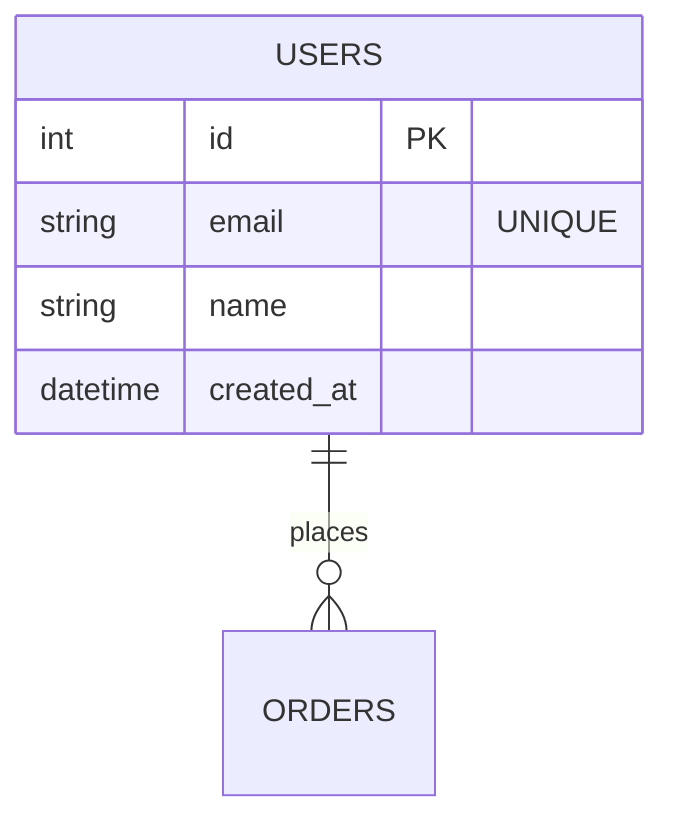

# CLAUDE.md

This file provides guidance to Claude Code (claude.ai/code) when working with code in this repository.

## Project Overview

This is a **High-Quality ERD Auto-Rendering System** built for UMC 9th Spring Boot course. The system automatically converts Mermaid ERD markdown files into high-resolution SVG and PNG images using GitHub Actions automation.

## Core Commands

### Development Commands
```bash
# Install dependencies
pnpm install

# Render all ERD files to SVG + PNG (3x scale for high resolution)
pnpm run render
```

### Package Manager
- **Required**: pnpm (version >=8.0.0)
- **Node.js**: >=18.0.0
- Do NOT use npm or yarn - this project is optimized for pnpm

## Architecture

### ERD Processing Pipeline
1. **Source**: Mermaid ERD files in `docs/erd/*.md`
2. **Processing**: Mermaid CLI (`@mermaid-js/mermaid-cli`) converts markdown
3. **Output**: Dual format generation
   - SVG: Vector format for infinite scaling
   - PNG: High-resolution (3x scale) for presentations

### Automation Workflow
- **Trigger**: Changes to `docs/erd/**/*.md` files
- **GitHub Actions**: `.github/workflows/erd-render.yml`
- **Auto-commit**: Rendered files committed back to repository
- **Preview**: VS Code Markdown Preview shows diagrams in real-time

## File Structure

```
docs/
├── erd/
│   ├── 01_core.md          # Basic e-commerce ERD
│   ├── 02_week0_mission.md # UMC mission app ERD (main project)
│   ├── *.svg              # Generated vector files
│   └── *.png              # Generated high-res images
└── sql/
    └── supabase_schema.sql # Complete database implementation
```

### ERD Content Architecture
- **01_core.md**: Simple e-commerce reference (USERS → ORDERS → PRODUCTS)
- **02_week0_mission.md**: Complex food delivery + mission app (11 tables)
  - User management with business/normal types
  - Store management with location-based search
  - Mission system with point rewards
  - Review and notification systems
  - Auto-calculated fields (ratings, participant counts)

## Development Workflow

### Local Development
1. Edit Mermaid ERD files in `docs/erd/*.md`
2. Use VS Code Markdown Preview for real-time diagram viewing
3. Run `pnpm run render` for high-quality output (optional)
4. Commit changes - GitHub Actions handles automatic rendering

### Mermaid ERD Format
```markdown


### Quality Standards
- **High Resolution**: 3x scale PNG for crisp presentation quality
- **Vector Support**: SVG for infinite scaling and technical documentation
- **Automated Consistency**: GitHub Actions ensures all diagrams are rendered with identical settings

## Database Implementation

### Complete SQL Schema
- **Location**: `docs/sql/supabase_schema.sql`
- **Target**: Supabase PostgreSQL
- **Features**:
  - Row Level Security (RLS) policies
  - Auto-updating triggers for calculated fields
  - Performance-optimized indexes
  - JSONB for flexible mission requirements

### Auto-Calculated Fields
```sql
-- Store ratings updated automatically from reviews
avg_rating, total_reviews

-- Mission participants tracked in real-time
current_participants
```

## Important Notes

### File Naming
- ERD files: `docs/erd/##_description.md` format
- Generated files automatically match: `##_description.svg`, `##_description.png`

### GitHub Actions Details
- Renders on every push to `docs/erd/**/*.md`
- Uses Ubuntu latest with Node.js 20
- Auto-commits with standardized message format
- Handles PR contexts without pushing

### VS Code Integration
- Mermaid preview works natively in VS Code Markdown Preview
- No additional extensions required for basic viewing
- Generated files provide publication-ready quality