# 🎯 High-Quality ERD Auto-Rendering System

**Mermaid 기반 고품질 ERD 자동 생성 시스템**

## 🚀 Features

- **고해상도 출력**: 3x scale PNG + 벡터 SVG 동시 생성
- **VS Code 미리보기**: Markdown Preview로 실시간 다이어그램 확인  
- **자동화**: GitHub Actions로 push 시 자동 렌더링
- **pnpm 최적화**: 빠른 패키지 관리 및 설치

## 📦 Setup

```bash
# pnpm 설치 (없는 경우)
npm install -g pnpm

# 의존성 설치
pnpm install

# ERD 렌더링 (모든 .md → .svg + .png)
pnpm run render
```

## 🛠️ Usage

### 로컬 개발
1. `docs/erd/*.md` 파일 수정 (Mermaid 코드블록 형식)
2. VS Code 미리보기로 실시간 확인
3. `pnpm run render` 고품질 이미지 생성 (선택)

### 자동화 워크플로우
- `docs/erd/**/*.md` 변경 → Push → GitHub Actions → 자동 SVG+PNG 생성

## 📊 Output Files

- **SVG**: 무한 확대 가능 (개발자/분석용)
- **PNG**: 고해상도 3x scale (문서/프레젠테이션용)

## 🎨 Current ERDs





---
*Powered by Mermaid + pnpm + GitHub Actions*
