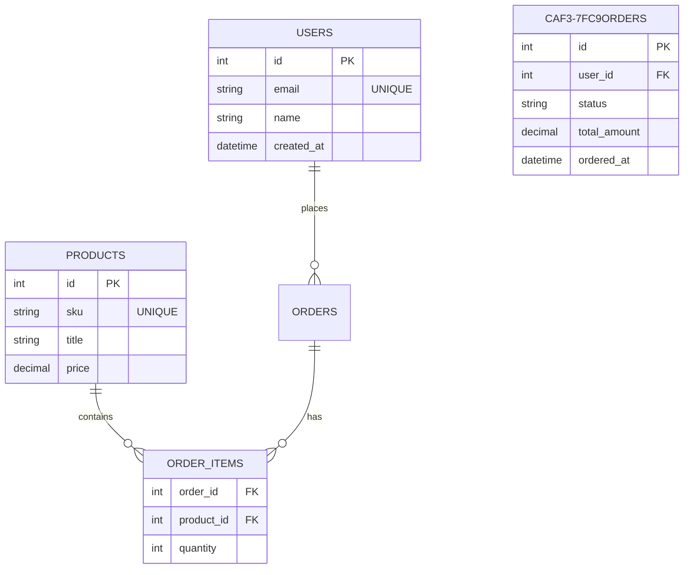

```mermaid
erDiagram
    USERS ||--o{ ORDERS : places
    USERS {
      int id PK
      string email "UNIQUE"
      string name
      datetime created_at
    }
    CAF3-7FC9ORDERS {
      int id PK
      int user_id FK
      string status
      decimal total_amount
      datetime ordered_at
    }
    PRODUCTS ||--o{ ORDER_ITEMS : contains
    ORDERS ||--o{ ORDER_ITEMS : has
    PRODUCTS {
      int id PK
      string sku "UNIQUE"
      string title
      decimal price
    }
    ORDER_ITEMS {
      int order_id FK
      int product_id FK
      int quantity
    }
```
