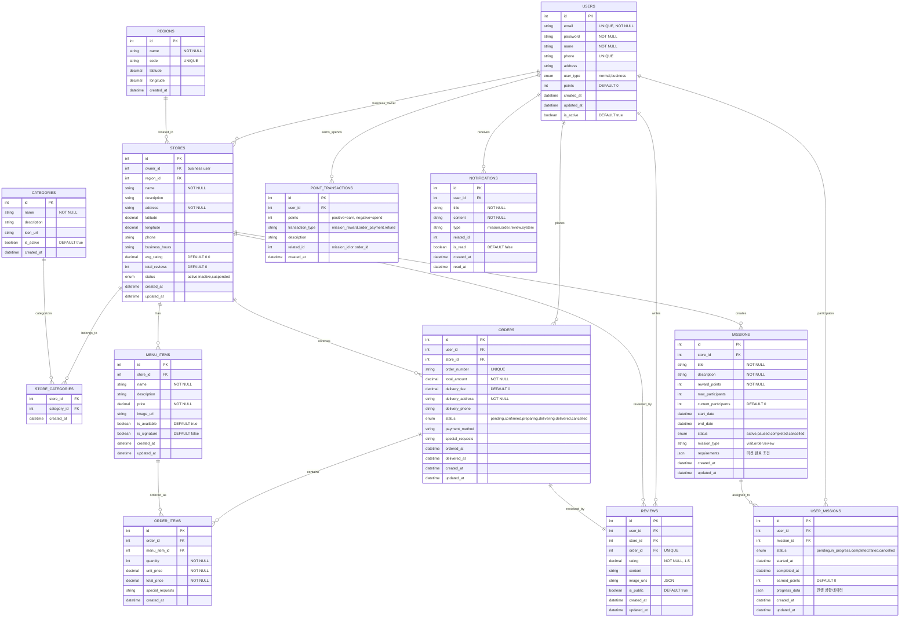

# 음식 배달 & 미션 앱 ERD

UMC Spring Week0 미션 - 와이어프레임과 IA 분석을 바탕으로 설계한 완벽한 ERD

## 📋 주요 설계 포인트

### 1. 사용자 시스템
- **일반/기업 사용자** 구분 (user_type)
- **포인트 시스템** 통합 관리
- **지역 기반** 서비스 제공

### 2. 가게 및 메뉴 관리
- **위치 기반** 검색 지원 (위도/경도)
- **카테고리별** 분류 시스템
- **평점 자동 계산** (avg_rating, total_reviews)
- **메뉴 시그니처** 표시 기능

### 3. 주문 시스템
- **주문 상태** 실시간 추적
- **배송비 별도** 관리
- **특별 요청사항** 지원
- **결제 방식** 다양화

### 4. 리뷰 시스템  
- **주문 기반** 리뷰 (1:1 관계)
- **이미지 리뷰** 지원 (JSON 배열)
- **공개/비공개** 설정 가능

### 5. 미션 시스템 (핵심 기능)
- **가게별 미션** 생성 가능
- **참여자 수 제한** 기능
- **다양한 미션 타입** (방문, 주문, 리뷰)
- **진행 상황** JSON으로 유연하게 관리
- **포인트 보상** 시스템

### 6. 알림 & 포인트
- **통합 알림** 시스템
- **포인트 내역** 상세 추적
- **트랜잭션 타입** 명확한 구분

## 🎯 와이어프레임 대응

- ✅ **7일 미션**: MISSIONS 테이블의 날짜 범위로 구현
- ✅ **미션 진행 상태**: USER_MISSIONS의 status로 추적  
- ✅ **지도 검색**: STORES의 위도/경도 데이터 활용
- ✅ **리뷰 작성**: REVIEWS 테이블로 주문별 리뷰 관리
- ✅ **포인트 시스템**: POINT_TRANSACTIONS로 상세 내역 관리
- ✅ **마이페이지**: 모든 사용자 데이터 통합 조회 가능