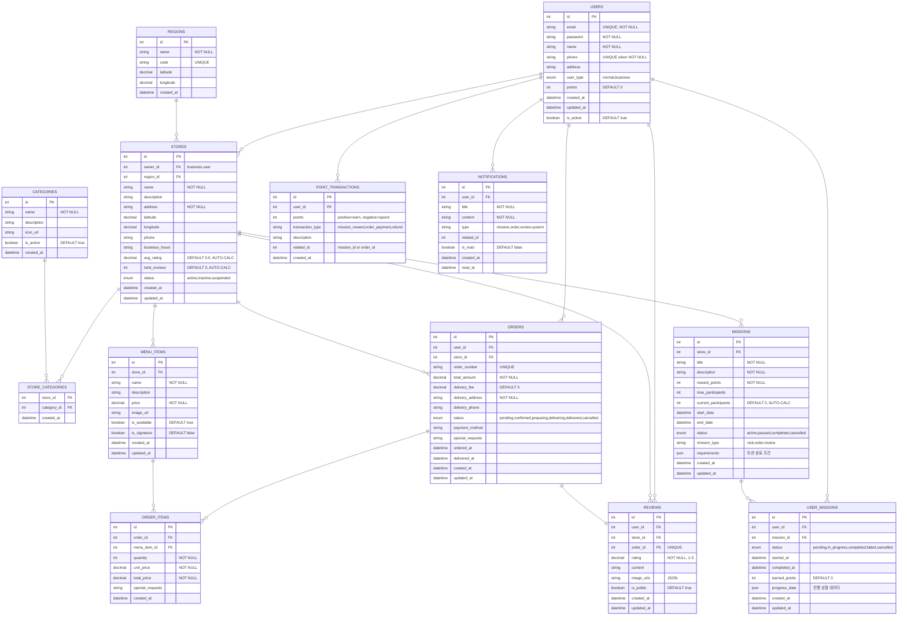

# 음식 배달 & 미션 앱 ERD

UMC Spring Week0 미션 - 와이어프레임과 IA 분석을 바탕으로 설계한 완벽한 ERD

## 📋 주요 설계 포인트

### 1. 사용자 시스템 (IA 기반)

- **일반/기업 사용자** 구분 (user_type)
- **기본 사용자 정보** 관리 (이름, 이메일, 전화번호)
- **휴대폰 번호** 선택적 입력 가능 (소셜 로그인 지원)
- **포인트 시스템** 통합 관리
- **지역 기반** 서비스 제공

### 2. 가게 및 메뉴 관리 (와이어프레임 기반)

- **위치 기반** 검색 지원 (위도/경도)
- **카테고리별** 분류 시스템
- **평점 자동 계산** (avg_rating, total_reviews) - 트리거로 실시간 동기화
- **메뉴 시그니처** 표시 기능

### 3. 주문 시스템

- **주문 상태** 실시간 추적
- **배송비 별도** 관리
- **특별 요청사항** 지원
- **결제 방식** 다양화

### 4. 리뷰 시스템

- **주문 기반** 리뷰 (1:1 관계)
- **이미지 리뷰** 지원 (JSON 배열)
- **공개/비공개** 설정 가능

### 5. 미션 시스템 (핵심 기능 - IA 7일 미션)

- **가게별 미션** 생성 가능
- **참여자 수 제한** 기능 - 트리거로 실시간 동기화
- **다양한 미션 타입** (방문, 주문, 리뷰)
- **진행 상황** JSON으로 유연하게 관리
- **포인트 보상** 시스템

### 6. 알림 & 포인트 (마이페이지 대응)

- **통합 알림** 시스템
- **포인트 내역** 상세 추적
- **트랜잭션 타입** 명확한 구분

## 🎯 기획자 요구사항 완벽 반영

### ✅ IA 구조 대응

- **온보딩**: 로그인 → 회원가입 → 선호조사 (USERS 테이블)
- **홈**: 내가 받은/수행중/완료한 미션 (USER_MISSIONS 상태별 조회)
- **미션**: 새로운 미션, 리뷰 요청 (MISSIONS 테이블)
- **지도**: 가게 리스트, 가게 정보 (STORES + 위치 데이터)
- **마이페이지**: 포인트, 정보변경, 로그아웃 (USERS + POINT_TRANSACTIONS)

### ✅ 와이어프레임 화면 대응

- **미션 목록**: 7일 미션 표시 및 참여 (MISSIONS + USER_MISSIONS)
- **지도 검색**: 위치 기반 가게 검색 (STORES 위도/경도)
- **가게 상세**: 메뉴, 리뷰, 주문 (MENU_ITEMS + REVIEWS + ORDERS)
- **리뷰 작성**: 별점, 텍스트, 이미지 (REVIEWS 테이블)
- **포인트 관리**: 적립/사용 내역 (POINT_TRANSACTIONS)

### ✅ Week0 미션 수준에 적합

- **11개 핵심 테이블**로 모든 기능 구현 가능
- **과도한 최적화 없이** 기능 중심 설계
- **깔끔한 관계선**으로 가독성 확보

## 🔧 핵심 개선사항 (2024년 최신화)

### 자동 동기화 시스템
- **미션 참여자 수**: user_missions 테이블 변경 시 자동 업데이트
- **가게 평점**: reviews 테이블 변경 시 자동 계산 및 업데이트
- **데이터 일관성**: 트리거를 통한 실시간 동기화 보장

### 사용자 경험 개선
- **소셜 로그인 지원**: 휴대폰 번호 선택적 입력 (NULL 허용)
- **실시간 반영**: 미션 참여/리뷰 작성 즉시 화면 업데이트
- **정확한 정보**: 계산된 값들의 실시간 정확성 보장
